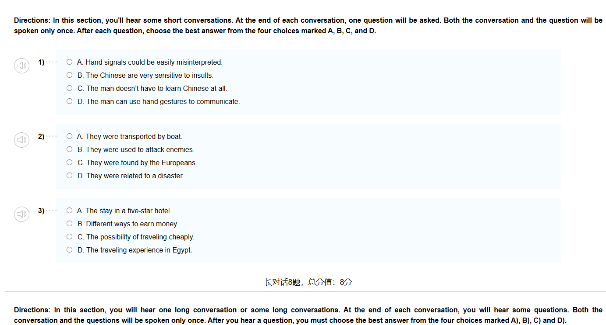
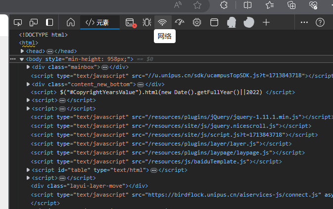
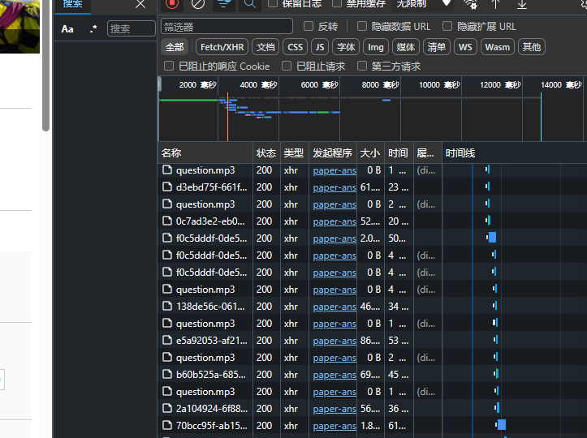
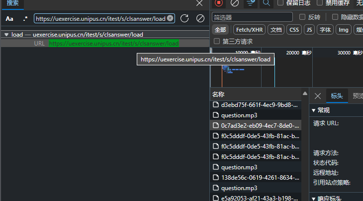
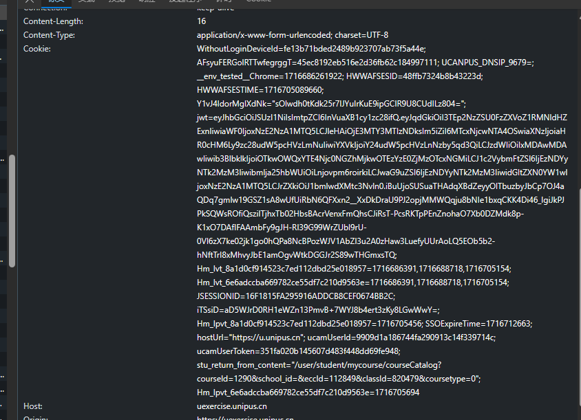
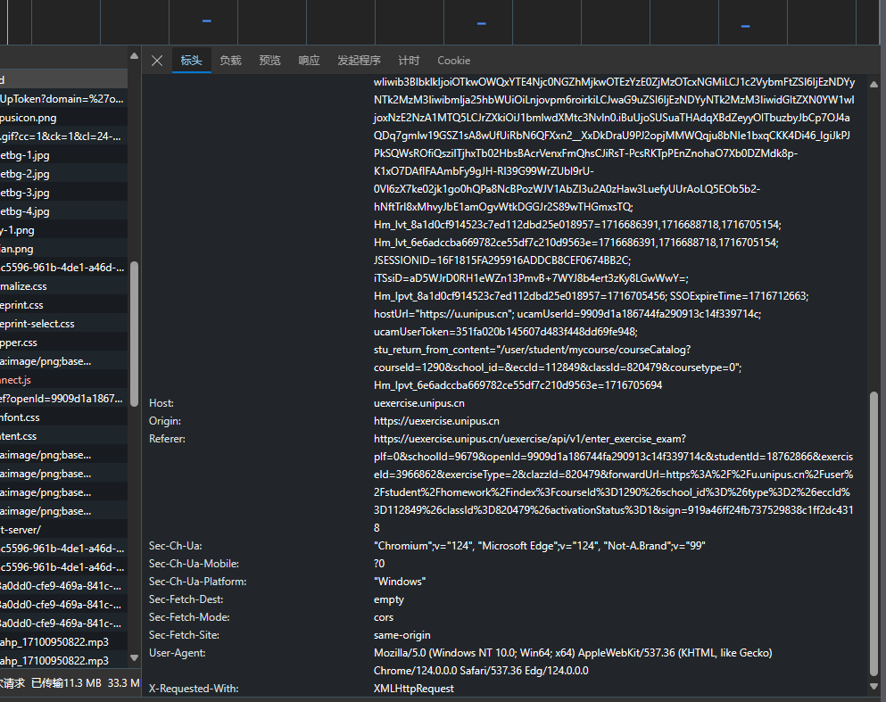
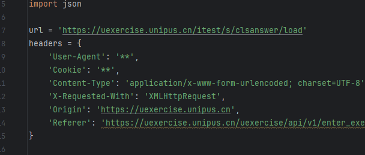
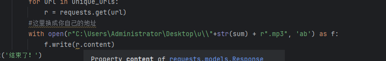
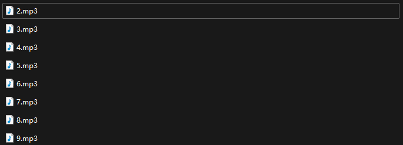

# U校园听力爬虫

考虑到爬虫的普适性，以及部分音频转文字api需要购买和库难以导入。就没有将音频识别为文字的功能集成在代码中。

### 功能介绍

我们可以看到平时做听力会很麻烦的，因为音频毕竟不是英文，无法粘贴给AI让其回答。

所以此小爬虫的功能是将u校园的听力的音频下载为mp3

后期用[音频转文本 - 100%免费和在线 (converter.app)](https://converter.app/cn/audio-text/)

这种类似的mp3转文本的网站进行转化

### 操作流程

首先提前打开浏览器开发者界面（F12键盘）并点进去网络界面

接着保持此界面，接着进入你想要爬取的课后测试

等待全部完成会出现很多网络请求

已经用brup抓包工具分析过了，只需要Ctrl+F 搜索 https://uexercise.unipus.cn/itest/s/clsanswer/load

即可找到指定的url我们点进去，这里我们采集两个数据

一个是Cookie

另一个是User-Agent

接着将复制到的数据粘贴到我们代码的指定位置

后续也需要自己定义合适的地址存放产生的mp3文件

然后就可以正常运行了！

### 运行效果

**注：1~n依据音频播放小喇叭的顺序**